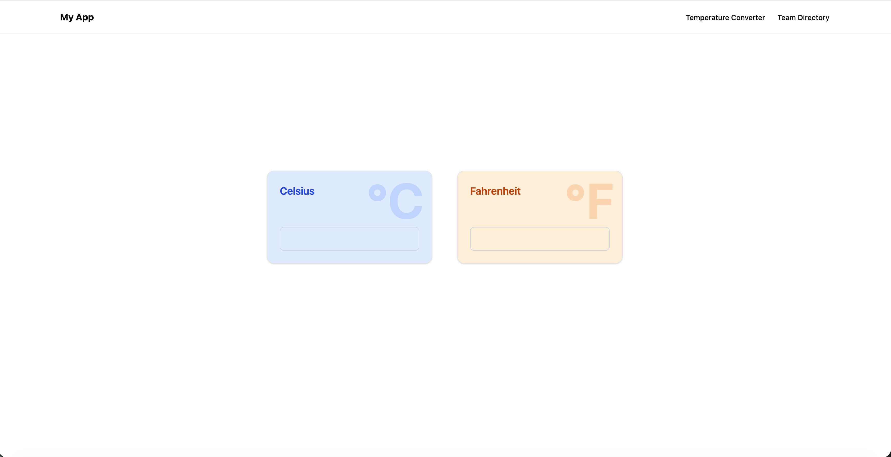
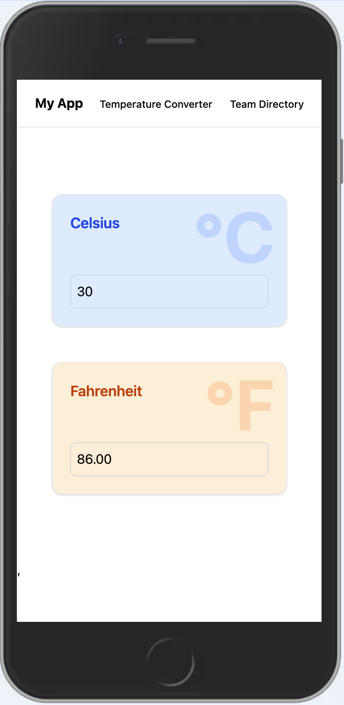
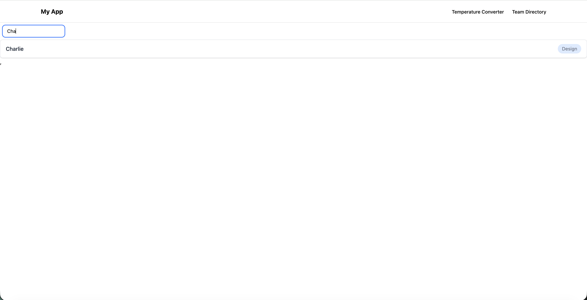

# Temperature Converter + Team Directory

A React project with two main features. Namely a temperature converter that converts from Celcius to Fahrenheit and vice versa as well as a searchable list of team members belonging to a certain organisation.

---

## Table of Contents

- [Installation](#installation)  
- [App Overview](#app-overview)

---

## Installation
In order to set up and run the project on your local device, make use of the following commands in your terminal:

1. Clone the repository:

```bash
git clone https://github.com/DVT-Grad-Projects-Mihir-Arjun/Temperature_Converter.git
```

2. Enter the project folder using:
```bash
cd temp-converter
```

3. Install dependencies using:
```bash
npm install
```

4. Start the development server by running:
```bash 
npm run dev
```

5. In your terminal you will see a message telling you at which URL you may access the application. The below is an example:
```bash
> movies@0.0.0 dev
> vite

Port 5173 is in use, trying another one...

  VITE v7.3.1  ready in 1521 ms

  ➜  Local:   http://localhost:5174/
  ➜  Network: use --host to expose
  ➜  press h + enter to show help
```
In the above example you can see that the app is viewable at http://localhost:5174/ (the port number in the URL may vary)

## App Overview
### Temperature Converter
When you first open the website, you are brought to the temperature converter as seen below:



Below you can see an example of the converter in action and you can also get a preview of our mobile view:




### Team Directory
Below you can see the team directory which displays all team members in a list which is fully searchable:


An example of a search can be seen below:

